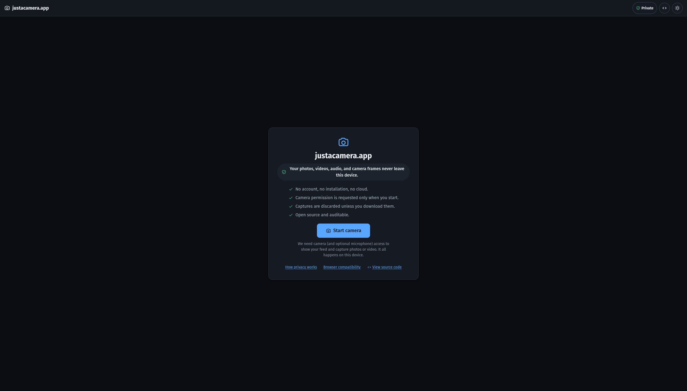
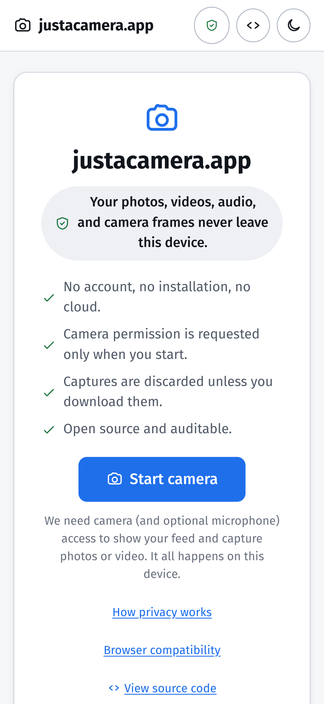

# justacamera.app

**Just a camera. Your photos, videos, audio, and camera frames never leave this
device.**

A privacy-first, fully client-side web camera app. Test your webcam and
microphone, view the live feed, take photos, and record video — entirely in your
browser. No accounts, no installation, no cloud, no backend, no tracking.



<p align="center">
  
</p>

## Why

Most "online webcam test" sites are ad-laden and ask you to trust that they
aren't keeping your video. justacamera.app removes the need for trust: there is
**no server to send anything to**, the code is open source and auditable, and a
suite of automated tests proves the no-upload invariant on every change.

## Privacy promise

After the initial page load over HTTPS, the app makes **no network requests** for
any camera, photo, recording, playback, or download operation:

- **No upload.** No backend, API, or media-processing server exists.
- **No accounts, cookies, or persistent identifiers.**
- **No third-party runtime scripts, fonts, images, or analytics.**
- **No telemetry** (see [docs/telemetry-schema.md](docs/telemetry-schema.md)).
- **Discarded by default.** Captures live only in memory until you download
  them; refreshing or closing the tab discards everything.
- **Identifiers stay local.** `deviceId`/`groupId`/raw labels are used only to
  select a device and are stripped from the diagnostic report.

The promise is enforced and proven — see
[docs/privacy-model.md](docs/privacy-model.md) and the privacy invariant tests.

## Features

- **Onboarding** that requests camera permission only after an explicit action,
  and recovers gracefully from denied / no-device / busy / unsupported /
  insecure-context / constraint failures.
- **Live preview** with camera + microphone selection and front/rear switching;
  a persistent, non-color-only "camera/mic active" indicator; reliable stop.
- **Photo capture** via `ImageCapture` with a universal canvas fallback;
  JPEG/PNG/WebP; quality control; countdown (off/3/5/10); separate
  **mirror-preview** and **mirror-output** controls.
- **Video recording** via `MediaRecorder` with dynamic codec selection
  (`isTypeSupported`), optional microphone audio, pause/resume, elapsed time +
  format display, large-recording warning, playback, and download.
- **Diagnostics panel** with negotiated track settings, capabilities, supported
  formats, and a one-click **sanitized** "Copy diagnostic report".
- **Capability-driven advanced controls** (zoom, torch, focus, exposure, white
  balance, brightness, contrast, saturation, sharpness) shown only where the
  active track supports them.
- **Light/dark themes**, responsive desktop/tablet/mobile layouts with safe-area
  support, reduced-motion support, and full keyboard operation.

## Supported browsers

Current Chrome/Edge, Firefox, and Safari (incl. iOS), over HTTPS (or localhost).
The core flow works everywhere; advanced photographic controls appear mostly on
Android Chrome. Full matrix and caveats:
[docs/browser-support.md](docs/browser-support.md). Honest coverage of what was
automatically vs manually tested is in
[docs/testing-strategy.md](docs/testing-strategy.md) and the
[manual checklist](docs/manual-test-checklist.md).

## Quick start (local development)

Requires **Node ≥ 22.12** (built with Node 24) and npm.

```bash
npm install        # install the locked dependency graph
npm run dev        # start the Vite dev server (http://localhost:5173)
```

Camera access requires a secure context; `localhost` qualifies.

## Commands

```bash
npm run dev            # dev server (HMR)
npm run build          # type-check + production build to dist/
npm run preview        # serve the production build with the real security headers
npm run type-check     # vue-tsc --build (strict)
npm run lint           # eslint
npm run format         # prettier --write
npm run format:check   # prettier --check
npm run test:unit      # vitest (unit + integration)
npm run test:coverage  # vitest with coverage
npm run test:e2e       # playwright (builds + previews, then runs Chromium + Firefox)
npm run test:a11y      # playwright @a11y subset (axe WCAG 2.2 AA)
npm run test:privacy   # playwright @privacy subset (no-exfil + no-persisted-media)
npm run audit:deps     # npm audit (high+)
npm run validate       # format:check + lint + type-check + unit + build
```

E2E needs browsers once: `npx playwright install chromium firefox`.

## Build & deploy

`npm run build` produces a static `dist/`. Serve it over HTTPS with the security
headers — ready-made configs are in [`deploy/`](deploy):

- [`deploy/Caddyfile`](deploy/Caddyfile) — Caddy (auto-HTTPS).
- [`deploy/nginx.conf`](deploy/nginx.conf) — nginx.

The header policy (CSP, Permissions-Policy, COOP/CORP, HSTS, Referrer-Policy,
nosniff, frame-ancestors) is defined once in
[`config/security-headers.ts`](config/security-headers.ts); a unit test asserts
the deploy configs stay in sync. The Vite **preview** server applies the same
headers so you can verify locally.

Configure the "View source" link for a fork with `VITE_REPO_URL` at build time.

## Architecture summary

Vue 3 + TypeScript (strict) + Vite, single view, no router/store. One
`CameraController` service owns the single `MediaStream`; pure utilities carry
the privacy/correctness invariants and are independently unit-tested; two
orthogonal discriminated-union state machines (session lifecycle + capture
activity) prevent invalid transitions; UI components hold no media business
logic. Full detail: [docs/architecture.md](docs/architecture.md).

```
src/
├── app/           App shell + metadata
├── assets/styles  design tokens + base CSS
├── components/    camera · diagnostics · feedback · layout · media · settings
├── composables/   Vue glue (session, object-url, announcer, prefs, theme, …)
├── features/      session-machine, capture-machine
├── services/      camera-controller, device, photo, recording, diagnostics, export
├── types/         shared domain types
└── utils/         constraints · mime-support · capabilities · sanitize · …
```

## Known limitations

- **Safari/WebKit** media flows are validated manually (Playwright has no
  dependable headless fake camera, and WebKit isn't installed in the test env). E2E media
  runs on Chromium (primary) and Firefox (secondary).
- **Advanced controls** (zoom/torch/focus/exposure) depend on the device +
  browser and are largely Android-Chromium-only; they're hidden where
  unsupported and can't be exercised by fake test devices.
- **Recording pause/resume** is reliable on Chromium/Firefox; Safari has known
  quirks (documented in [docs/browser-support.md](docs/browser-support.md)).
- **PWA/offline** and an optional local gallery are intentionally **deferred**
  until the core flow's gates were met.

## Documentation

| Doc                                                       | Purpose                                         |
| --------------------------------------------------------- | ----------------------------------------------- |
| [architecture.md](docs/architecture.md)                   | Runtime architecture, ownership, state model    |
| [privacy-model.md](docs/privacy-model.md)                 | The privacy invariant and its enforcement/proof |
| [threat-model.md](docs/threat-model.md)                   | Threats and mitigations                         |
| [browser-support.md](docs/browser-support.md)             | Cross-browser behavior matrix                   |
| [testing-strategy.md](docs/testing-strategy.md)           | Test pyramid + commands                         |
| [telemetry-schema.md](docs/telemetry-schema.md)           | Telemetry policy (disabled)                     |
| [implementation-plan.md](docs/implementation-plan.md)     | Plan, decisions, checklist                      |
| [manual-test-checklist.md](docs/manual-test-checklist.md) | Cross-device manual matrix                      |

## Contributing

See [CONTRIBUTING.md](CONTRIBUTING.md). In short: keep the privacy invariant
sacred, prefer native browser APIs, add tests, and run `npm run validate` before
opening a PR.

## Security

To report a vulnerability, see [SECURITY.md](SECURITY.md). Please do not open a
public issue for security reports.

## License

[AGPL-3.0-or-later](LICENSE). The hosted-source reciprocity of the AGPL means
anyone who deploys a modified version must also publish its source — reinforcing
the auditability that the privacy promise depends on. (Rationale and the
Apache-2.0 alternative are documented in
[docs/implementation-plan.md](docs/implementation-plan.md#2-assumptions-explicit).)
